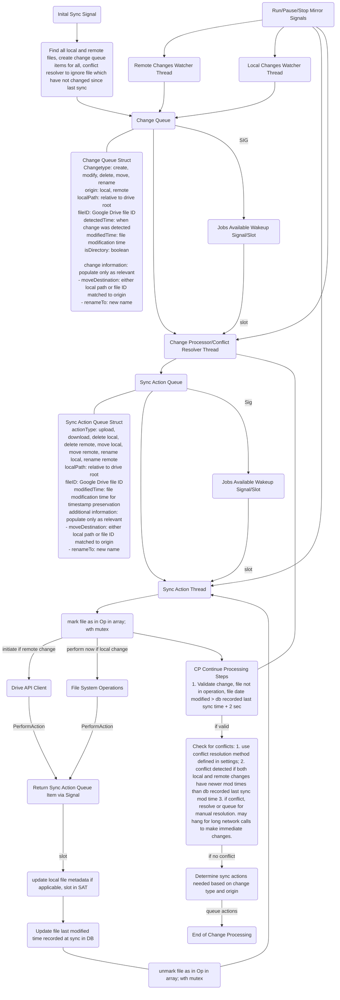
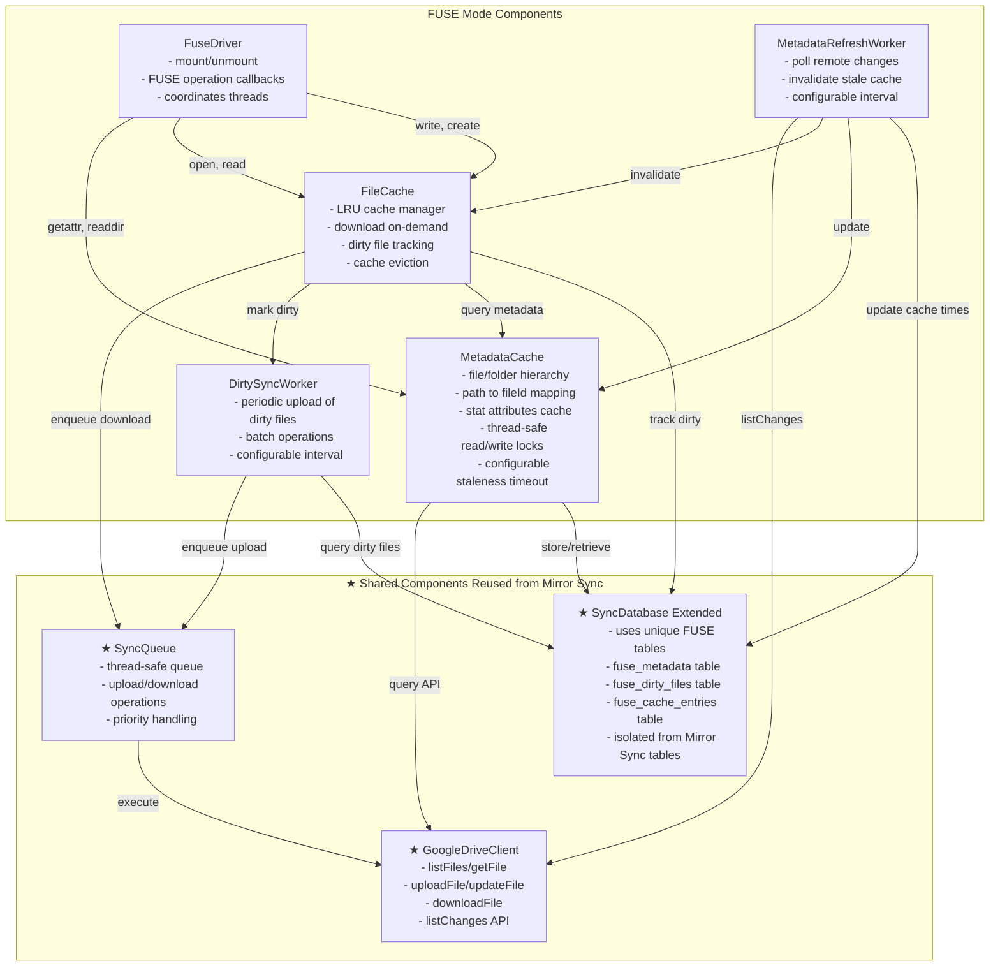

## Mirror Sync Procedure Flow Chart



## Implementation Details

### Local Changes Watcher (LocalChangeWatcher)

- Uses QFileSystemWatcher to monitor the sync folder
- Detects: file/folder creation, modification, deletion
- Move/rename detection via debounced delete+create pattern matching
- Configurable ignore patterns (_.tmp, .git/_, etc.)
- States: Stopped, Running, Paused
- Creates ChangeQueueItem with origin=Local for each detected change

### Remote Changes Watcher (RemoteChangeWatcher)

- Polls Google Drive Changes API at configurable interval (default: 30s)
- Manages change page token for incremental updates
- Filters: only ownedByMe files, excludes Google Docs, excludes trashed
- States: Stopped, Running, Paused
- Creates ChangeQueueItem with origin=Remote for each change
- Requires folder ID to path mapping for path resolution

### Change Queue (ChangeQueue)

- Thread-safe queue using QMutex and QWaitCondition
- enqueue() called from watcher threads, dequeue() from processor
- waitForItems(timeoutMs) blocks until items available or timeout
- Emits itemsAvailable() signal when queue transitions from empty to non-empty
- Supports removal by path or file ID for deduplication

### Change Processor/Conflict Resolver (ChangeProcessor)

- Takes from: Change Queue (CQ)
- Outputs to: Sync Action Queue (SAQ)
- Receives: Jobs Available Wakeup Signal from Change Queue (itemsAvailable)
- States: Stopped, Running, Paused
- Processing steps:
    1. **Validation**: Ensure file not in operation (tracked in m_filesInOperation set with mutex), and file date modified > db recorded last sync time + 2 seconds
    2. **Conflict Detection**: Check if BOTH local AND remote have modifications newer than db sync time (may involve LONG BLOCKING NETWORK CALL to fetch remote metadata)
    3. **Conflict Resolution**: Apply configured strategy (KeepLocal, KeepRemote, KeepBoth, KeepNewest, AskUser)
    4. **Action Determination**: Map change type + origin to appropriate sync action(s)
- Conflict resolution strategies:
    - KeepLocal: Queue upload to overwrite remote
    - KeepRemote: Queue download to overwrite local
    - KeepBoth: Create local conflict copy, download remote, upload conflict copy
    - KeepNewest: Automatically choose KeepLocal or KeepRemote based on timestamps
    - AskUser: Store conflict in m_unresolvedConflicts for manual resolution
- Action mapping (change type + origin → sync action):
    - Create + Local → Upload
    - Create + Remote → Download
    - Modify + Local → Upload
    - Modify + Remote → Download
    - Delete + Local → DeleteRemote
    - Delete + Remote → DeleteLocal
    - Move + Local → MoveRemote
    - Move + Remote → MoveLocal
    - Rename + Local → RenameRemote
    - Rename + Remote → RenameLocal
- Files in operation tracking:
    - markFileInOperation(path): Called by Sync Action Thread when starting operation
    - unmarkFileInOperation(path): Called by Sync Action Thread when operation completes
    - isFileInOperation(path): Used during validation to skip files currently being processed
- Initial sync mode: When setInitialSync(true), conflict detection skips files unchanged since last sync

### Sync Action Queue (SyncActionQueue)

- Thread-safe queue using QMutex and QWaitCondition
- enqueue() called from Change Processor, dequeue() from Sync Action Thread
- waitForItems(timeoutMs) blocks until items available or timeout
- Emits itemsAvailable() signal when queue transitions from empty to non-empty (Jobs Available Wakeup for SAT)
- Supports removal by path or file ID
- SyncActionItem struct:
    - actionType: Upload, Download, DeleteLocal, DeleteRemote, MoveLocal, MoveRemote, RenameLocal, RenameRemote
    - localPath: relative to sync root
    - fileId: Google Drive file ID
    - modifiedTime: for timestamp preservation on downloads
    - moveDestination: for move operations
    - renameTo: for rename operations

## When queue empty:

Note all threads should poll/watch their respective queues for 30s, checking every 0.25 secs. If this timeouts, they should go to sleep, waiting for the "Jobs Available Wakeup Signal/Slot" to wake them up when new items are added to their queues.
A "running" should be triggered such that the queue can avoid emitting start signals when the processor threads are already running.

## FUSE Procedure Flow Chart

The FUSE (Filesystem in Userspace) mode provides on-demand access to Google Drive files through a virtual filesystem. Files are downloaded only when accessed and are cached locally for performance.

### FUSE Component Structure

High-level component architecture showing classes to build. Components marked with ★ are reused from Mirror Sync system.



### FUSE Database Schema

FUSE mode uses the **SyncDatabase class** with **unique tables** isolated from Mirror Sync. These tables are added to the existing database at `~/.local/share/Via/via_sync.db`:

```sql
-- ============================================
-- FUSE-SPECIFIC TABLES (DO NOT AFFECT MIRROR SYNC)
-- ============================================

-- File and folder metadata cache for FUSE operations
CREATE TABLE fuse_metadata (
    file_id TEXT PRIMARY KEY,
    path TEXT NOT NULL,
    name TEXT NOT NULL,
    parent_id TEXT,
    is_folder INTEGER NOT NULL DEFAULT 0,
    size INTEGER DEFAULT 0,
    mime_type TEXT,
    created_time TEXT,
    modified_time TEXT,
    cached_at TEXT NOT NULL,
    last_accessed TEXT
);

-- Dirty files tracking (modified locally in FUSE, pending upload)
CREATE TABLE fuse_dirty_files (
    file_id TEXT PRIMARY KEY,
    path TEXT NOT NULL,
    marked_dirty_at TEXT NOT NULL,
    last_upload_attempt TEXT,
    upload_failed INTEGER DEFAULT 0
);

-- Cached file tracking for LRU eviction in FUSE cache
CREATE TABLE fuse_cache_entries (
    file_id TEXT PRIMARY KEY,
    cache_path TEXT NOT NULL,
    size INTEGER NOT NULL,
    last_accessed TEXT NOT NULL,
    download_completed TEXT NOT NULL
);

-- Remote change token tracking for FUSE metadata refresh
CREATE TABLE fuse_sync_state (
    key TEXT PRIMARY KEY,
    value TEXT
);

-- ============================================
-- EXISTING MIRROR SYNC TABLES (UNCHANGED)
-- ============================================
-- files, deleted_files, settings, conflicts
-- These tables are used only by Mirror Sync mode
-- and are NOT accessed by FUSE mode
```

**Note**: The SyncDatabase class will be extended with new methods for FUSE operations:

```cpp
// Data structures matching the database schema
struct FuseMetadata {
    QString fileId;
    QString path;
    QString name;
    QString parentId;
    bool isFolder;
    qint64 size;
    QString mimeType;
    QDateTime createdTime;
    QDateTime modifiedTime;
    QDateTime cachedAt;
    QDateTime lastAccessed;
};

struct FuseCacheEntry {
    QString fileId;
    QString cachePath;
    qint64 size;
    QDateTime lastAccessed;
    QDateTime downloadCompleted;
};

// Metadata operations
FuseMetadata getFuseMetadata(const QString& fileId);
bool saveFuseMetadata(const FuseMetadata& metadata);
bool deleteFuseMetadata(const QString& fileId);

// Dirty file tracking
QList<QString> getFuseDirtyFiles();
bool markFuseDirty(const QString& fileId, const QString& path);
bool clearFuseDirty(const QString& fileId);

// Cache entry management
QList<FuseCacheEntry> getFuseCacheEntries();
bool recordFuseCacheEntry(const QString& fileId, const QString& cachePath, qint64 size);
bool updateCacheAccessTime(const QString& fileId);
bool evictFuseCacheEntry(const QString& fileId);

// Sync state (change tokens, etc.)
QString getFuseSyncState(const QString& key);
bool setFuseSyncState(const QString& key, const QString& value);
```

### MetadataCache Interface Details

The MetadataCache component provides in-memory caching of file/folder metadata with database persistence. It is the primary interface for FUSE operations that need file attributes (getattr) or directory listings (readdir).

#### Data Structure

```cpp
struct FuseFileMetadata {
    QString fileId;           // Google Drive file ID
    QString path;             // Full path relative to mount point
    QString name;             // File/folder name
    QString parentId;         // Parent folder's Google Drive file ID
    bool isFolder;            // Whether this is a folder
    qint64 size;              // File size in bytes (0 for folders)
    QString mimeType;         // MIME type
    QDateTime createdTime;    // Creation timestamp
    QDateTime modifiedTime;   // Last modification timestamp
    QDateTime cachedAt;       // When this metadata was cached
    QDateTime lastAccessed;   // When this entry was last accessed

    bool isValid() const;     // Returns true if fileId and path are set
    bool isStale(int maxAgeSeconds) const;  // Check if cache entry is stale
};
```

#### Public Interface

**Path-based Lookups (Primary FUSE Interface)**

```cpp
// Get metadata by path - fast, non-blocking
FuseFileMetadata getMetadataByPath(const QString& path) const;

// Get metadata with API fetch fallback - may block on cache miss
FuseFileMetadata getOrFetchMetadataByPath(const QString& path, bool* fetched = nullptr);

// Check if path exists in cache
bool hasPath(const QString& path) const;
```

**FileId-based Lookups**

```cpp
FuseFileMetadata getMetadataByFileId(const QString& fileId) const;
QString getFileIdByPath(const QString& path) const;
QString getPathByFileId(const QString& fileId) const;
```

**Directory Operations (for readdir)**

```cpp
// Get children of a directory - fast
QList<FuseFileMetadata> getChildren(const QString& parentPath) const;

// Get children with API fetch fallback - may block
QList<FuseFileMetadata> getOrFetchChildren(const QString& parentPath, bool* fetched = nullptr);

// Check if directory children are cached and fresh
bool hasChildrenCached(const QString& parentPath) const;
```

**Cache Modification**

```cpp
void setMetadata(const FuseFileMetadata& metadata);
void setMetadataBatch(const QList<FuseFileMetadata>& metadataList);
void removeByPath(const QString& path);
void removeByFileId(const QString& fileId);
bool updatePath(const QString& oldPath, const QString& newPath);
bool updateParentId(const QString& fileId, const QString& newParentId);
void markAccessed(const QString& path);
```

**Cache Invalidation**

```cpp
void invalidate(const QString& path);
void invalidateByFileId(const QString& fileId);
void invalidateChildren(const QString& parentPath);
void clearCache();      // In-memory only
void clearAll();        // Including database
```

**Configuration**

```cpp
void setMaxCacheAge(int seconds);     // Default: 300 (5 minutes)
int maxCacheAge() const;
void setRootFolderId(const QString& fileId);
QString rootFolderId() const;
```

#### Signals

```cpp
void metadataUpdated(const QString& path);
void metadataRemoved(const QString& path);
void metadataFetched(const QString& path, bool success);
void cacheCleared();
void cacheError(const QString& error);
```

#### Thread Safety

- All public methods are thread-safe using QReadWriteLock
- Read operations (get, has, getChildren) use shared locks for concurrency
- Write operations (set, remove, invalidate) use exclusive locks
- Statistics counters (hits/misses) are updated atomically

#### Integration Points

1. **FuseDriver** → MetadataCache: For getattr and readdir operations
2. **MetadataCache** → SyncDatabase: Persistence to fuse_metadata table
3. **MetadataCache** → GoogleDriveClient: API calls on cache miss (fileReceived, filesListed signals)
4. **MetadataRefreshWorker** → MetadataCache: Invalidation and updates from remote changes
5. **FileCache** → MetadataCache: Query metadata when opening files

### Detailed FUSE Procedure Flow

```mermaid
flowchart TD
    %% FUSE Mount and Initialization
    APP(Application Startup)-->FUSE_INIT{FUSE Enabled?}
    FUSE_INIT--Yes-->MOUNT(Mount FUSE Filesystem)
    FUSE_INIT--No-->END_INIT(Continue with Mirror Sync Mode)

    MOUNT-->FUSE_THREAD(FUSE Thread Created)
    FUSE_THREAD-->FUSE_OPS(Register FUSE Operations Handlers)
    FUSE_OPS-->METADATA_INIT(Initialize Metadata Cache from DB/API)
    METADATA_INIT-->CACHE_INIT(Initialize File Cache Manager)
    CACHE_INIT-->MOUNTED(Filesystem Mounted and Ready)

    %% User File Operations
    USER(User File Operation)-->FUSE_KERNEL(Linux Kernel FUSE Driver)

    %% FUSE Operation Handlers
    FUSE_KERNEL-->GETATTR[fuse_getattr: Get File Attributes]
    FUSE_KERNEL-->READDIR[fuse_readdir: List Directory]
    FUSE_KERNEL-->OPEN[fuse_open: Open File]
    FUSE_KERNEL-->READ[fuse_read: Read File Data]
    FUSE_KERNEL-->WRITE[fuse_write: Write File Data]
    FUSE_KERNEL-->CREATE[fuse_create: Create New File]
    FUSE_KERNEL-->UNLINK[fuse_unlink: Delete File]
    FUSE_KERNEL-->MKDIR[fuse_mkdir: Create Directory]
    FUSE_KERNEL-->RMDIR[fuse_rmdir: Remove Directory]
    FUSE_KERNEL-->RENAME[fuse_rename: Rename/Move File]
    FUSE_KERNEL-->TRUNCATE[fuse_truncate: Truncate File]

    %% getattr flow
    GETATTR-->META_LOOKUP{Path in Metadata Cache?}
    META_LOOKUP--Yes-->RETURN_ATTR(Return stat structure)
    META_LOOKUP--No-->QUERY_FUSE_DB(Query FuseDatabase for metadata)
    QUERY_FUSE_DB-->CACHED_IN_DB{Found in FuseDatabase?}
    CACHED_IN_DB--Yes-->RETURN_ATTR
    CACHED_IN_DB--No-->API_GET_META(Queue API: Get File Metadata)
    API_GET_META-->UPDATE_META_CACHE(Update Metadata Cache)
    UPDATE_META_CACHE-->SAVE_TO_FUSE_DB(Save to FuseDatabase.fuse_metadata)
    SAVE_TO_FUSE_DB-->RETURN_ATTR
    RETURN_ATTR-->USER_RESULT(Return to User)

    %% readdir flow
    READDIR-->DIR_META_LOOKUP{Directory in Cache?}
    DIR_META_LOOKUP--Yes-->RETURN_DIR_ENTRIES(Return Directory Entries)
    DIR_META_LOOKUP--No-->API_LIST_CHILDREN(Queue API: List Children)
    API_LIST_CHILDREN-->UPDATE_DIR_CACHE(Update Directory Cache)
    UPDATE_DIR_CACHE-->SAVE_DIR_TO_DB(Save children to FuseDatabase.fuse_metadata)
    SAVE_DIR_TO_DB-->RETURN_DIR_ENTRIES
    RETURN_DIR_ENTRIES-->USER_RESULT

    %% open flow
    OPEN-->FILE_CACHE_CHECK{File in Cache?}
    FILE_CACHE_CHECK--Yes, Fresh-->UPDATE_ACCESS_TIME(Update FuseDatabase.fuse_cache_entries.last_accessed)
    UPDATE_ACCESS_TIME-->CACHE_PATH(Return Cached File Path)
    FILE_CACHE_CHECK--Yes, Stale-->INVALIDATE_CACHE(Invalidate Cache Entry)
    INVALIDATE_CACHE-->DOWNLOAD_FILE
    FILE_CACHE_CHECK--No-->DOWNLOAD_FILE(Queue API: Download File)
    DOWNLOAD_FILE-->WAIT_DOWNLOAD(Wait for Download Complete)
    WAIT_DOWNLOAD-->STORE_CACHE(Store in Cache: ~/.cache/Via/)
    STORE_CACHE-->RECORD_CACHE_ENTRY(Record in FuseDatabase.fuse_cache_entries)
    RECORD_CACHE_ENTRY-->CACHE_SIZE_CHECK{Cache Size > Max?}
    CACHE_SIZE_CHECK--Yes-->EVICT_LRU(Evict LRU Files from DB and disk)
    CACHE_SIZE_CHECK--No-->CACHE_PATH
    EVICT_LRU-->CACHE_PATH
    CACHE_PATH-->OPEN_FD(Open File Descriptor)
    OPEN_FD-->USER_RESULT

    %% read flow
    READ-->READ_CACHED(Read from Cached File)
    READ_CACHED-->UPDATE_READ_TIME(Update FuseDatabase.fuse_cache_entries.last_accessed)
    UPDATE_READ_TIME-->USER_RESULT

    %% write flow
    WRITE-->WRITE_CACHED(Write to Cached File)
    WRITE_CACHED-->MARK_DIRTY(Mark File as Dirty)
    MARK_DIRTY-->RECORD_DIRTY(Record in FuseDatabase.fuse_dirty_files)
    RECORD_DIRTY-->DIRTY_SYNC_CHECK{Sync Immediately?}
    DIRTY_SYNC_CHECK--Yes-->UPLOAD_NOW(Queue API: Upload File)
    DIRTY_SYNC_CHECK--No-->DELAY_UPLOAD(Delay Upload Until Close/Flush)
    UPLOAD_NOW-->UPDATE_REMOTE(Update Remote File)
    DELAY_UPLOAD-->USER_RESULT
    UPDATE_REMOTE-->CLEAR_DIRTY_DB(Clear from FuseDatabase.fuse_dirty_files)
    CLEAR_DIRTY_DB-->UPDATE_META_CACHE_DB(Update FuseDatabase.fuse_metadata modified_time)
    UPDATE_META_CACHE_DB-->USER_RESULT

    %% create flow
    CREATE-->CREATE_LOCAL(Create Empty File in Cache)
    CREATE_LOCAL-->API_CREATE(Queue API: Create Remote File)
    API_CREATE-->STORE_FILE_ID(Store File ID in Metadata Cache)
    STORE_FILE_ID-->SAVE_NEW_FILE_DB(Save to FuseDatabase.fuse_metadata)
    SAVE_NEW_FILE_DB-->USER_RESULT

    %% unlink flow
    UNLINK-->REMOVE_CACHE_FILE(Remove from Cache if Present)
    REMOVE_CACHE_FILE-->DELETE_CACHE_ENTRY(Delete from FuseDatabase.fuse_cache_entries)
    DELETE_CACHE_ENTRY-->API_DELETE(Queue API: Delete Remote File)
    API_DELETE-->REMOVE_META_DB(Remove from FuseDatabase.fuse_metadata)
    REMOVE_META_DB-->USER_RESULT

    %% mkdir flow
    MKDIR-->API_CREATE_FOLDER(Queue API: Create Remote Folder)
    API_CREATE_FOLDER-->STORE_FOLDER_ID(Store Folder ID in Metadata Cache)
    STORE_FOLDER_ID-->SAVE_FOLDER_DB(Save to FuseDatabase.fuse_metadata)
    SAVE_FOLDER_DB-->USER_RESULT

    %% rmdir flow
    RMDIR-->CHECK_EMPTY{Directory Empty?}
    CHECK_EMPTY--No-->RETURN_ERROR(Return -ENOTEMPTY)
    CHECK_EMPTY--Yes-->API_DELETE_FOLDER(Queue API: Delete Remote Folder)
    API_DELETE_FOLDER-->REMOVE_DIR_META_DB(Remove from FuseDatabase.fuse_metadata)
    REMOVE_DIR_META_DB-->USER_RESULT
    RETURN_ERROR-->USER_RESULT

    %% rename flow
    RENAME-->PARSE_RENAME(Parse Old and New Paths)
    PARSE_RENAME-->RENAME_TYPE{Rename or Move?}
    RENAME_TYPE--Rename Only-->API_RENAME(Queue API: Rename File)
    RENAME_TYPE--Move Only-->API_MOVE(Queue API: Move File to New Parent)
    RENAME_TYPE--Both-->API_RENAME_MOVE(Queue API: Rename and Move)
    API_RENAME-->UPDATE_META_NAME_DB(Update name in FuseDatabase.fuse_metadata)
    API_MOVE-->UPDATE_META_PARENT_DB(Update parent_id in FuseDatabase.fuse_metadata)
    API_RENAME_MOVE-->UPDATE_META_BOTH_DB(Update name and parent_id in FuseDatabase.fuse_metadata)
    UPDATE_META_NAME_DB-->USER_RESULT
    UPDATE_META_PARENT_DB-->USER_RESULT
    UPDATE_META_BOTH_DB-->USER_RESULT

    %% truncate flow
    TRUNCATE-->TRUNCATE_CACHED(Truncate Cached File)
    TRUNCATE_CACHED-->MARK_DIRTY

    %% Background Components
    MOUNTED-->DIRTY_SYNC_THREAD(Dirty Files Sync Thread)
    DIRTY_SYNC_THREAD-->POLL_DIRTY{Check Dirty Queue default: every 5s}
    POLL_DIRTY--Has Dirty Files-->QUERY_DIRTY_DB(Query FuseDatabase.fuse_dirty_files)
    QUERY_DIRTY_DB-->BATCH_UPLOAD(Queue Batch Uploads)
    BATCH_UPLOAD-->UPDATE_REMOTE
    POLL_DIRTY--Empty-->SLEEP_DIRTY(Sleep default: 5s)
    SLEEP_DIRTY-->POLL_DIRTY

    MOUNTED-->METADATA_REFRESH_THREAD(Metadata Refresh Thread)
    METADATA_REFRESH_THREAD-->POLL_CHANGES{Poll for Remote Changes default: every 30s}
    POLL_CHANGES-->GET_CHANGE_TOKEN(Get token from FuseDatabase.fuse_sync_state)
    GET_CHANGE_TOKEN-->API_LIST_CHANGES(Queue API: List Changes Since Token)
    API_LIST_CHANGES-->PROCESS_CHANGES{Changes Received?}
    PROCESS_CHANGES--Modified-->INVALIDATE_CACHE
    PROCESS_CHANGES--Deleted-->DELETE_META_DB(Delete from FuseDatabase.fuse_metadata)
    PROCESS_CHANGES--Created-->UPDATE_META_CACHE
    DELETE_META_DB-->UPDATE_CHANGE_TOKEN(Update Change Token)
    UPDATE_META_CACHE-->SAVE_META_DB(Save to FuseDatabase.fuse_metadata)
    SAVE_META_DB-->UPDATE_CHANGE_TOKEN
    UPDATE_CHANGE_TOKEN-->SAVE_TOKEN_DB(Save to FuseDatabase.fuse_sync_state)
    SAVE_TOKEN_DB-->SLEEP_REFRESH(Sleep default: 30s)
    SLEEP_REFRESH-->POLL_CHANGES

    %% API Thread Communication
    API_GET_META-->API_QUEUE(API Request Queue)
    API_LIST_CHILDREN-->API_QUEUE
    DOWNLOAD_FILE-->API_QUEUE
    UPLOAD_NOW-->API_QUEUE
    API_CREATE-->API_QUEUE
    API_DELETE-->API_QUEUE
    API_CREATE_FOLDER-->API_QUEUE
    API_DELETE_FOLDER-->API_QUEUE
    API_RENAME-->API_QUEUE
    API_MOVE-->API_QUEUE
    API_RENAME_MOVE-->API_QUEUE
    BATCH_UPLOAD-->API_QUEUE
    API_LIST_CHANGES-->API_QUEUE

    API_QUEUE-->API_WORKER(API Worker Thread in Main Thread Context)
    API_WORKER-->GD(Google Drive API Client)
    GD-->API_RESPONSE(API Response Signal)
    API_RESPONSE-->FUSE_CALLBACK(Signal/Slot Back to FUSE Handler)

    %% Error Handling
    GD--API Error-->ERR_CHECK{Error Type}
    ERR_CHECK--Network Error-->RETRY_BACKOFF(Retry with Exponential Backoff)
    RETRY_BACKOFF-->API_QUEUE
    ERR_CHECK--Auth Error-->REFRESH_TOKEN(Refresh OAuth Token)
    REFRESH_TOKEN-->API_QUEUE
    ERR_CHECK--Not Found-->RETURN_ENOENT(Return -ENOENT)
    RETURN_ENOENT-->USER_RESULT
    ERR_CHECK--Rate Limit-->WAIT_QUOTA(Wait for Rate Limit Reset)
    WAIT_QUOTA-->API_QUEUE
    ERR_CHECK--Permission Denied-->RETURN_EACCES(Return -EACCES)
    RETURN_EACCES-->USER_RESULT

    %% Unmount
    UNMOUNT_SIGNAL(Unmount Signal)-->FLUSH_DIRTY(Flush All Dirty Files)
    FLUSH_DIRTY-->STOP_THREADS(Stop Background Threads)
    STOP_THREADS-->CLEAR_CACHE_MEM(Clear In-Memory Caches)
    CLEAR_CACHE_MEM-->UNMOUNT_FUSE(Unmount FUSE Filesystem)
    UNMOUNT_FUSE-->UNMOUNTED(Filesystem Unmounted)
```



### Key Differences from Mirror Sync Mode

1. **On-Demand Access**: Files are only downloaded when opened, not synced in advance
2. **No Local Watcher**: FUSE intercepts all file operations directly, no need to watch filesystem
3. **Cache Management**: LRU cache eviction manages disk space usage
4. **Metadata Cache**: File/folder structure cached separately from file contents
5. **Dirty File Tracking**: Modified files tracked and synced asynchronously
6. **No Conflict Resolution**: FUSE operations are immediate; conflicts prevented by synchronous writes

### Threading Architecture

- **FUSE Thread**: Handles FUSE callback operations (runs in FUSE context)
- **Main Thread**: Qt event loop processes API requests queued from FUSE thread
- **Dirty Sync Thread**: Background thread periodically uploads modified files
- **Metadata Refresh Thread**: Background thread polls for remote changes

### Cache Structure

```
~/.cache/Via/
├── files/
│   ├── <hash_subdir>/        # 2-char hash prefix subdirectory
│   │   ├── <sha256_hash>     # File cached by SHA256 hash of fileId
│   │   └── ...
│   └── ...
```

**Note**: Cache paths use SHA256 hash of fileId to avoid filesystem issues with Google Drive IDs.
The first 2 characters of the hash are used as a subdirectory for better filesystem distribution.

**Database**: FUSE metadata stored in `~/.local/share/Via/via_sync.db`

- Tables: `fuse_metadata`, `fuse_dirty_files`, `fuse_cache_entries`, `fuse_sync_state`
- Completely isolated from Mirror Sync tables (`files`, `deleted_files`, `settings`, `conflicts`)

### Performance Considerations

1. **Metadata Cache**: Critical for performance; all `getattr` and `readdir` must be fast
2. **Parallel Downloads**: Multiple files can download simultaneously
3. **Write Buffering**: Writes are buffered and synced in batches
4. **Stale Cache Check**: Checks remote modified time before serving cached files
5. **Cache Size Limit**: Default 10GB, configurable in Settings > Advanced > FUSE Cache Settings
6. **Polling Intervals**: Dirty sync (default 5s) and metadata refresh (default 30s) are configurable in Settings > Advanced > FUSE Cache Settings

### FileCache Interface Summary

The FileCache component provides the following key interfaces:

```cpp
// Cache Configuration
QString cacheDirectory() const;
void setCacheDirectory(const QString& path);
qint64 maxCacheSize() const;
void setMaxCacheSize(qint64 bytes);
qint64 currentCacheSize() const;

// Cache Operations (used by FuseDriver)
bool isCached(const QString& fileId) const;
QString getCachedPath(const QString& fileId, qint64 expectedSize = 0);  // May block for download
QString getCachePathForFile(const QString& fileId) const;  // No download
void updateAccessTime(const QString& fileId);
void invalidate(const QString& fileId);
void removeFromCache(const QString& fileId);
void clearCache();

// Dirty File Tracking (for DirtySyncWorker)
void markDirty(const QString& fileId, const QString& path);
void clearDirty(const QString& fileId);
void markUploadFailed(const QString& fileId);
bool isDirty(const QString& fileId) const;
QList<DirtyFileEntry> getDirtyFiles() const;

// Cache Management
bool evictToFreeSpace(qint64 bytesNeeded);
bool recordCacheEntry(const QString& fileId, const QString& localPath, qint64 size);

// Signals
void downloadStarted(const QString& fileId);
void downloadCompleted(const QString& fileId, const QString& cachePath);
void downloadFailed(const QString& fileId, const QString& error);
void fileEvicted(const QString& fileId);
void cacheSizeChanged(qint64 newSize);
void fileDirty(const QString& fileId, const QString& path);
```

### MetadataRefreshWorker Interface Details

The MetadataRefreshWorker polls Google Drive for remote changes and updates local FUSE caches accordingly. It implements the "Metadata Refresh Thread" from the FUSE procedure flow chart.

#### State

```cpp
enum class State { Stopped, Running, Paused };
```

#### Configuration

```cpp
void setPollingInterval(int intervalMs);  // Default: 30000 (30 seconds)
int pollingInterval() const;
void setChangeToken(const QString& token);
QString changeToken() const;
State state() const;
```

#### Control Methods

```cpp
void start();     // Load token from DB, start polling
void stop();      // Stop polling completely
void pause();     // Pause temporarily
void resume();    // Resume after pause
void checkNow();  // Trigger immediate check
```

#### Signals

```cpp
void stateChanged(State state);
void error(const QString& error);
void changeTokenUpdated(const QString& token);
void changeProcessed(const QString& fileId, const QString& changeType);  // "created", "modified", "deleted"
void refreshCompleted(int changesCount);
```

#### Integration Points

1. **MetadataRefreshWorker → GoogleDriveClient**: Calls `listChanges()` API for remote changes
2. **MetadataRefreshWorker → MetadataCache**: `setMetadata()` for new/modified files, `removeByFileId()` for deleted
3. **MetadataRefreshWorker → FileCache**: `invalidate()` for modified files (forces re-download)
4. **MetadataRefreshWorker → SyncDatabase**: `getFuseSyncState()`/`setFuseSyncState()` for change token persistence

#### Change Processing Logic (per flow chart)

```
Poll for Changes (every 30s default)
  → Get token from fuse_sync_state
  → listChanges(token) via GoogleDriveClient
  → For each change:
      - Deleted/Trashed → removeByFileId() from MetadataCache + FileCache
      - Modified → invalidate() FileCache + setMetadata() in MetadataCache
      - Created → setMetadata() in MetadataCache
  → Save new token to fuse_sync_state
```

### DirtySyncWorker Interface Summary

The DirtySyncWorker component provides background upload of dirty files with the following interfaces:

```cpp
// Worker State Management
enum class DirtySyncWorkerState { Stopped, Running, Paused, Uploading };

// Configuration
int syncIntervalMs() const;                    // Get sync interval (default: 5000ms)
void setSyncIntervalMs(int ms);                // Set sync interval (minimum: 1000ms)
int maxRetries() const;                        // Get max upload retries (default: 3)
void setMaxRetries(int count);                 // Set max upload retries
int uploadTimeoutMs() const;                   // Get upload timeout (default: 300000ms)
void setUploadTimeoutMs(int ms);               // Set upload timeout (minimum: 10000ms)
DirtySyncWorkerState state() const;            // Get current worker state

// Statistics
int pendingCount() const;                      // Number of dirty files waiting
int uploadedCount() const;                     // Files uploaded since start
int failedCount() const;                       // Failed uploads since start

// Control (public slots)
void start();                                  // Start periodic sync
void stop();                                   // Stop worker (does not flush)
void pause();                                  // Pause without stopping thread
void resume();                                 // Resume after pause
void flushAndStop();                           // Upload all dirty files, then stop
void syncNow();                                // Trigger immediate sync cycle

// Signals
void stateChanged(DirtySyncWorkerState state); // Worker state changed
void uploadStarted(const QString& fileId, const QString& path);
void uploadCompleted(const QString& fileId, const QString& path);
void uploadFailed(const QString& fileId, const QString& path, const QString& error);
void syncCycleCompleted(int uploadedCount, int failedCount);
void error(const QString& error);              // General error signal
void flushCompleted(bool success);             // Flush operation completed
```

**Integration Points:**

- **FileCache**: `getDirtyFiles()`, `clearDirty()`, `markUploadFailed()`, `getCachePathForFile()`
- **GoogleDriveClient**: `updateFile()` for uploading, `fileUpdated`/`fileUploaded` signals
- **SyncDatabase**: Persistent dirty file tracking via `fuse_dirty_files` table

**Lifecycle:**

1. Created by FuseDriver when FUSE mode is enabled
2. Started when FUSE filesystem successfully mounts
3. Polls for dirty files at configurable interval (default 5s)
4. On FUSE unmount, `flushAndStop()` is called to ensure all changes are uploaded
5. Stopped when FUSE unmounts

### Component Interactions

```
FuseDriver                      FileCache                       SyncDatabase
    |                               |                               |
    |---(fuse_open)---------------->|                               |
    |                               |---isCached()----------------->|
    |                               |<---(cache entry or null)------|
    |                               |                               |
    |                               |---(if not cached)------------>|
    |                               |   downloadFile() via          |
    |                               |   GoogleDriveClient           |
    |                               |                               |
    |                               |---recordFuseCacheEntry()----->|
    |<---(cache path)---------------|                               |
    |                               |                               |
    |---(fuse_write)--------------->|                               |
    |                               |---markFuseDirty()------------>|
    |<---(success)------------------|                               |
    |                               |                               |
DirtySyncWorker                     |                               |
    |---getDirtyFiles()------------>|                               |
    |<---(dirty file list)----------|                               |
    |                               |                               |
    |---(after upload)------------->|                               |
    |   clearDirty()                |---clearFuseDirty()----------->|
    |                               |                               |
MetadataRefreshWorker               |                               |
    |---(on remote change)--------->|                               |
    |   invalidate()                |---evictFuseCacheEntry()------>|
```
